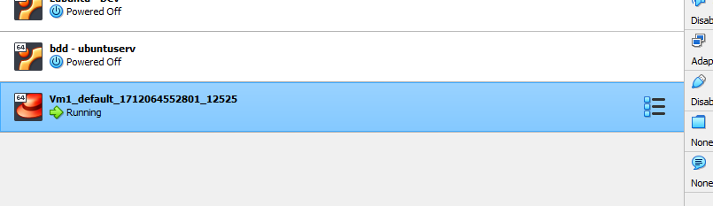

# TP1 : Programmatic provisioning

## Sommaire

- [TP1 : Programmatic provisioning](#tp1--programmatic-provisioning)
  - [Sommaire](#sommaire)
- [I. Une première VM](#i-une-première-vm)
  - [1. ez startup](#1-ez-startup)
  - [2. Un peu de conf](#2-un-peu-de-conf)
- [II. Initialization script](#ii-initialization-script)
- [III. Repackaging](#iii-repackaging)
- [IV. Multi VM](#iv-multi-vm)
- [V. cloud-init](#v-cloud-init)

# I. Une première VM

## 1. ez startup

➜ **Préparons le terrain pour la première VM**

```bash
# générez un fichier Vagrantfile initial
$ vagrant init generic/rocky9

# un fichier Vagrantfile a été créé dans le dossier courant
# explorez son contenu, c'est quasiment que des commentaires quand on le génère comme ça
$ cat Vagrantfile
```

---

Pour le moment, la conf, on s'en branle, on va juste allumer la VM ! Komsa :

```bash
# on allume la VM
# ça marche que si on est dans un dossier qui contient un Vagrantfile
$ vagrant up

# voir le statut de la VM
$ vagrant status

# une fois terminé, on peut SSH vers notre VM facilement avec :
$ vagrant ssh

# si vous voulez voir les paramètres de la commande SSH effectuée par Vagrant vous pouvez utiliser
$ vagrant ssh-config

# enfin vous pouvez éteindre et détruire la VM avec
$ vagrant halt
$ vagrant destroy -f # -f permet de détruire même si on a pas éteint (halt) la VM avant
```

➜ *Vous pouvez aussi constater que la VM est allumée dans votre hyperviseur.*



🌞 **`Vagrantfile` dans le dépôt git de rendu SVP !**

## 2. Un peu de conf

Avec Vagrant, il est possible de gérer un certains nombres de paramètres de la VM.

🌞 **Ajustez le `Vagrantfile` pour que la VM créée** :

- ait l'IP `10.1.1.11/24`
- porte le hostname `ezconf.tp1.efrei`
- porte le nom (pour Vagrant) `ezconf.tp1.efrei` (ce n'est pas le hostname de la machine)
- ait 2G de RAM
- ait un disque dur de 20G

```bash
Vagrant.configure("2") do |config|
  config.vm.box = "generic/rocky9"

  config.vm.network "private_network", ip: "192.168.50.4"

  config.vm.hostname = "ezconf.tp1.efrei"

  config.vm.define "ezconf.tp1.efrei"

  config.vm.provider "virtualbox" do |vb|
    vb.memory = "2048"
  end

  config.disksize.size = '20GB'
end
```

# II. Initialization script

🌞 **Ajustez le `Vagrantfile`** :

```Vagrantfile
Vagrant.configure("2") do |config|
  config.vm.box = "generic/rocky9"

  config.vm.provision "shell", path: "script.sh"

  config.vm.network "private_network", ip: "192.168.50.4"

  config.vm.hostname = "ezconf.tp1.efrei"

  config.vm.define "ezconf.tp1.efrei"

  config.vm.provider "virtualbox" do |vb|
    vb.memory = "2048"
  end

  config.disksize.size = '20GB'
end
```

script.sh
(on en profite pour resoudre le problème de dns)
```bash
sudo echo 'nameserver 1.1.1.1' > /etc/resolv.conf

sudo dnf update -y

sudo dnf install -y python3 vim
```

# III. Repackaging

La marche à suivre pour faire ça est la suivante :

```bash
$ Vm3_InitialisationScript> vagrant package --output rocky-efrei.box

==> default: Attempting graceful shutdown of VM...
==> default: Clearing any previously set forwarded ports...
==> default: Exporting VM...
==> default: Compressing package to: Vm3_InitialisationScript/rocky-efrei.box

# on ajoute le fichier .box produit à la liste des box que gère Vagrant
$ Vm3_InitialisationScript> vagrant box add rocky-efrei rocky-efrei.box

==> box: Box file was not detected as metadata. Adding it directly...
==> box: Adding box 'rocky-efrei' (v0) for provider:
    box: Unpacking necessary files from: Vm3_InitialisationScript/rocky-efrei.box
    box:
==> box: Successfully added box 'rocky-efrei' (v0) for ''!

# la box est visible dans la liste des box Vagrant
$ Vm3_InitialisationScript> vagrant box list

generic/rocky9 (virtualbox, 4.3.12, (amd64))
rocky-efrei    (virtualbox, 0)
```

# IV. Multi VM

🌞 **Un deuxième `Vagrantfile` qui définit** :

- une VM `node1.tp1.efrei`
  - IP `10.1.1.101/24`
  - 2G de RAM
- une VM `node2.tp1.efrei`
  - IP `10.1.1.102/24`
  - 1G de RAM

```Vagrantfile
Vagrant.configure("2") do |config| 
  config.vm.define "node1" do |node1|
    node1.vm.box = "generic/rocky9"
    node1.vm.network "private_network", ip: "10.1.1.101"
    node1.vm.provider "virtualbox" do |vb|
      vb.memory = "2048"
    end
  end

  config.vm.define "node2" do |node2|
    node1.vm.box = "generic/rocky9" 
    node1.vm.network "private_network", ip: "10.1.1.102"
    node1.vm.provider "virtualbox" do |vb|
      vb.memory = "1024"
    end
  end
end
```

🌞 **Une fois les VMs allumées, assurez-vous que vous pouvez ping `10.1.1.102` depuis `node1`**

```bash
[vagrant@node1   ~]$ ping 10.1.1.102
PING 10.1.1.102 (10.1.1.102) 56(84) bytes of data.
64 bytes from 10.1.1.102: icmp_seq=1 ttl=64 time=2.24 ms
64 bytes from 10.1.1.102: icmp_seq=2 ttl=64 time=0.597 ms
64 bytes from 10.1.1.102: icmp_seq=3 ttl=64 time=0.501 ms
```

# V. cloud-init

🌞 **Repackager une box Vagrant**

Il faut dabord creer la vm et y installer les éléments :

```Vagrantfile
Vagrant.configure("2") do |config|
  config.vm.box = "generic/rocky9"

  config.vm.provision "shell", path: "script.sh" 
end
```

script.sh
```bash
sudo echo 'nameserver 1.1.1.1' > /etc/resolv.conf

sudo dnf update -y

sudo dnf install -y cloud-init

sudo systemctl enable cloud-init
```

Rpackage :

```bash
vagrant package --output rocky-cloud-init.box
vagrant box add rocky-cloud-init rocky-cloud-init.box
```

🌞 **Tester !**

```Vagrantfile
Vagrant.configure("2") do |config|
  config.vm.box = "rocky-cloud-init"

  config.vm.cloud_init :user_data, content_type: "text/cloud-config", path: "user_data.yml"
end
```

user_data.yml :
```yml
---
users:
  - name: antna
    primary_group: antna
    groups: wheel
    shell: /bin/bash
    sudo: ALL=(ALL) NOPASSWD:ALL
    lock_passwd: false
    passwd: $6$iuqbPcBadz2HSt97$kUUI7qoWbrH4fTY.CpErukwCZVMnWUWzepoYP3PIHGaveGm1VGWBuNWRB/vPKXdh/UNSOwAuljFv3unFLrw07/ # admin
    ssh_authorized_keys:
      - ssh-rsa AAAAB3NzaC1yc2EAAAADAQABAAACAQCrpd9MU1MDMbfCWZRmw/dv6jlK4KibcUQr
```


