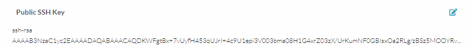
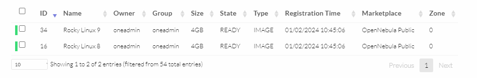
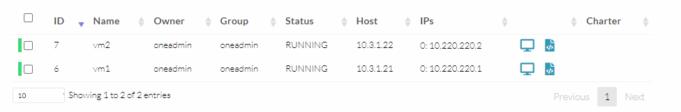

# TP3 : Self-hosted private cloud platform

## Sommaire

- [TP3 : Self-hosted private cloud platform](#tp3--self-hosted-private-cloud-platform)
  - [Sommaire](#sommaire)
- [I. Présentation du lab](#i-présentation-du-lab)
  - [1. Architecture](#1-architecture)
- [II. Setup](#ii-setup)
- [III. Utiliser la plateforme](#iii-utiliser-la-plateforme)
- [IV. Ajouter d'un noeud et VXLAN](#iv-ajouter-dun-noeud-et-vxlan)
  - [2. VM sur le deuxième noeud](#2-vm-sur-le-deuxième-noeud)
  - [3. Connectivité entre les VMs](#3-connectivité-entre-les-vms)
  - [4. Inspection du trafic](#4-inspection-du-trafic)

# I. Présentation du lab

## 1. Architecture

| Node           | IP Address  | Rôle                         |
|----------------|-------------|------------------------------|
| `frontend.one` | `10.3.1.11` | WebUI OpenNebula             |
| `kvm1.one`     | `10.3.1.21` | Hyperviseur + Endpoint VXLAN |
| `kvm2.one`     | `10.3.1.22` | Hyperviseur + Endpoint VXLAN |

# II. Setup

➜ [un doc dédié pour le setup du frontend](./frontend.md)

➜ [un doc dédié pour le setup des noeuds KVM](./kvm.md)

➜ [un doc dédié pour le setup du réseau](./network.md)

# III. Utiliser la plateforme

➜ **RDV de nouveau sur la WebUI de OpenNebula, et naviguez dans `Settings > Onglet Auth`**



➜ **Toujours sur la WebUI de OpenNebula, naviguez dans `Storage > Apps`**



➜ **Toujouuuuurs sur la WebUI de OpenNebula, naviguez dans `Instances > VMs`**



➜ **Tester la connectivité à la VM**

```bash
[vagrant@frontend ~]$ sudo su - oneadmin

[oneadmin@frontend ~]$ eval $(ssh-agent)
Agent pid 8236

[oneadmin@frontend ~]$ ssh-add
Identity added: /var/lib/one/.ssh/id_rsa (oneadmin@rocky9.localdomain)

[oneadmin@frontend ~]$ ssh -A oneadmin@10.3.1.21
Last login: Wed Apr 10 13:30:26 2024 from 10.3.1.11

[oneadmin@kvm1 ~]$ ssh root@10.220.220.1
Last login: Wed Apr 10 12:48:58 2024 from 10.220.220.201

[root@localhost ~]# ping 10.220.220.2
PING 10.220.220.2 (10.220.220.2) 56(84) bytes of data.
64 bytes from 10.220.220.2: icmp_seq=1 ttl=64 time=1.18 ms
64 bytes from 10.220.220.2: icmp_seq=2 ttl=64 time=0.959 ms
64 bytes from 10.220.220.2: icmp_seq=3 ttl=64 time=0.656 ms
```

# IV. Ajouter d'un noeud et VXLAN

## 2. VM sur le deuxième noeud

🌞 **Lancer une deuxième VM**

- vous pouvez la forcer à tourner sur `kvm2.one` lors de sa création
- mettez la dans le même réseau que le premier `kvm1.one`
- assurez-vous que vous pouvez vous y connecter en SSH

## 3. Connectivité entre les VMs

🌞 **Les deux VMs doivent pouvoir se ping**

```bash
[root@localhost ~]# ping 10.220.220.2
PING 10.220.220.2 (10.220.220.2) 56(84) bytes of data.
64 bytes from 10.220.220.2: icmp_seq=1 ttl=64 time=1.18 ms
64 bytes from 10.220.220.2: icmp_seq=2 ttl=64 time=0.959 ms
64 bytes from 10.220.220.2: icmp_seq=3 ttl=64 time=0.656 ms
```

## 4. Inspection du trafic

🌞 **Téléchargez `tcpdump` sur l'un des noeuds KVM**

➜ Voir [le fichier de capture eth1](./eth1.pcap) et [le fichier de capture vxlan_bridge](./vxlan-bridge.pcap)

```bash
# capturer le trafic de eth1, et l'enregistrer dans un fichier yo.pcap
tcpdump -i eth1 -w yo.pcap
```

➜ **Analysez les deux captures**

- dans la capture de `eth1` vous devriez juste voir du trafic UDP entre les deux noeuds
  - si vous regardez bien, vous devriez que ce trafic UDP contient lui-même des trames
- dans la capture de `vxlan-bridge`, vous devriez voir les "vraies" trames échangées par les deux VMs


