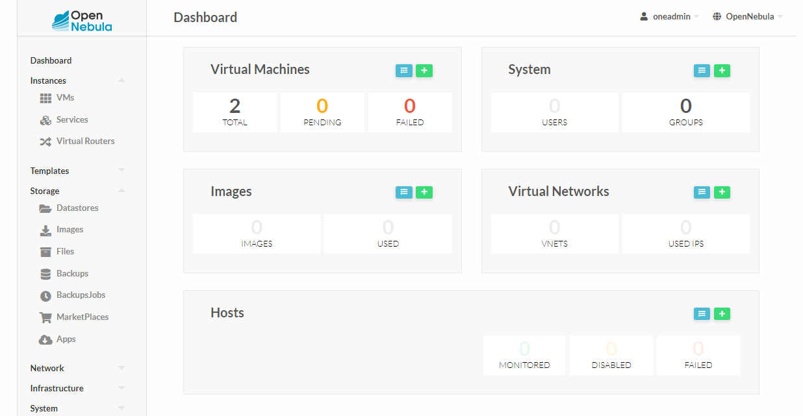

# II.1. Setup Frontend

## Sommaire

- [II.1. Setup Frontend](#ii1-setup-frontend)
  - [Sommaire](#sommaire)
  - [A. Database](#a-database)
  - [B. OpenNebula](#b-opennebula)
  - [C. Conf système](#c-conf-système)
  - [D. Test](#d-test)

## A. Database

🌞 **Installer un serveur MySQL**

```bash
[oneadmin@frontend ~] wget https://dev.mysql.com/get/mysql80-community-release-el9-5.noarch.rpm 

[oneadmin@frontend ~] sudo rpm -ivh mysql80-community-release-el9-5.noarch.rpm

[oneadmin@frontend ~] dnf search install mysql-community-server
```

🌞 **Démarrer le serveur MySQL**

```bash
[oneadmin@frontend ~] sudo systemctl start mysqld
[oneadmin@frontend ~] sudo systemctl enable mysqld
```

🌞 **Setup MySQL**

```SQL
ALTER USER 'root'@'localhost' IDENTIFIED BY 'password';
CREATE USER 'oneadmin' IDENTIFIED BY 'password';
CREATE DATABASE opennebula;
GRANT ALL PRIVILEGES ON opennebula.* TO 'oneadmin';
SET GLOBAL TRANSACTION ISOLATION LEVEL READ COMMITTED;
```

## B. OpenNebula

🌞 **Ajouter les dépôts Open Nebula**

- ajoutez le dépôt suivant dans `/etc/yum.repos.d/opennebula.repo`

```
[opennebula]
name=OpenNebula Community Edition
baseurl=https://downloads.opennebula.io/repo/6.8/RedHat/$releasever/$basearch
enabled=1
gpgkey=https://downloads.opennebula.io/repo/repo2.key
gpgcheck=1
repo_gpgcheck=1
```

- puis effectuer un ptit `dnf makecache -y` pour accélérer la suite :)

🌞 **Installer OpenNebula**

```bash
[oneadmin@frontend ~] sudo dnf install opennebula opennebula-sunstone opennebula-fireedge
```

🌞 **Configuration OpenNebula**

- dans le fichier `/etc/one/oned.conf`

```conf
DB = [ BACKEND = "mysql",
       SERVER  = "localhost",
       PORT    = 0,
       USER    = "oneadmin",
       PASSWD  = "also_here_define_another_strong_password",
       DB_NAME = "opennebula",
       CONNECTIONS = 25,
       COMPARE_BINARY = "no" ]
```

🌞 **Créer un user pour se log sur la WebUI OpenNebula**

- pour ça, il faut se log en tant que l'utilisateur `oneadmin` sur le serveur
- une fois connecté en tant que `oneadmin`, inscrivez le user et le password de votre choix dans le fichier `/var/lib/one/.one/one_auth` sous la forme `user:password`

🌞 **Démarrer les services OpenNebula**

```bash
[oneadmin@frontend ~] sudo systemctl start opennebula opennebula-sunstone
[oneadmin@frontend ~] sudo systemctl enable opennebula opennebula-sunstone
```

## C. Conf système

🌞 **Ouverture firewall**

- ouvrez les ports suivants, avec des commandes `firewall-cmd` :

| Port  | Proto      | Why ?                        |
|-------|------------|------------------------------|
| 9869  | TCP        | WebUI (Sunstone)             |
| 22    | TCP        | SSH                          |
| 2633  | TCP        | Daemon `oned` et API XML RPC |
| 4124  | TPC et UDP | Monitoring                   |
| 29876 | TCP        | NoVNC proxy                  |

```bash
[vagrant@frontend ~]$ sudo firewall-cmd --permanent --zone=public --add-port=9869/tcp
success
[vagrant@frontend ~]$ sudo firewall-cmd --permanent --zone=public --add-port=22/tcp
success
[vagrant@frontend ~]$ sudo firewall-cmd --permanent --zone=public --add-port=2633/tcp
success
[vagrant@frontend ~]$ sudo firewall-cmd --permanent --zone=public --add-port=4124/tcp
success
[vagrant@frontend ~]$ sudo firewall-cmd --permanent --zone=public --add-port=4124/udp
success
[vagrant@frontend ~]$ sudo firewall-cmd --permanent --zone=public --add-port=29876/tcp
success
[vagrant@frontend ~]$ sudo firewall-cmd --reload
success
```

## D. Test

A ce stade, vous devriez déjà pouvoir **visiter la WebUI de OpenNebula.**

**RDV sur `http://10.3.1.11:9869`**


