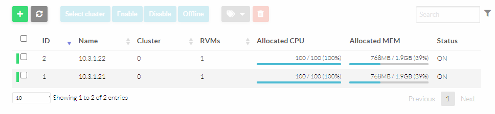

# II. 2. Noeuds KVM

## Sommaire

- [II. 2. Noeuds KVM](#ii-2-noeuds-kvm)
  - [Sommaire](#sommaire)
  - [A. KVM](#a-kvm)
  - [B. Système](#b-système)
  - [C. Ajout des noeuds au cluster](#c-ajout-des-noeuds-au-cluster)

## A. KVM

🌞 **Ajouter des dépôts supplémentaires**

- ajoutez le dépôt suivant dans `/etc/yum.repos.d/opennebula.repo`

```
[opennebula]
name=OpenNebula Community Edition
baseurl=https://downloads.opennebula.io/repo/6.8/RedHat/$releasever/$basearch
enabled=1
gpgkey=https://downloads.opennebula.io/repo/repo2.key
gpgcheck=1
repo_gpgcheck=1
```

- ajoutez aussi les dépôts EPEL en exécutant :

```bash
[oneadmin@kvm ~] sudo dnf install -y epel-release
```

🌞 **Installer KVM**

```bash
[oneadmin@frontend ~] sudo dnf install opennebula-node-kvm
```

🌞 **Démarrer le service `libvirtd`**

```bash
[oneadmin@frontend ~] sudo systemctl sart libvirtd
[oneadmin@frontend ~] sudo systemctl enable libvirtd
```

## B. Système

🌞 **Ouverture firewall**

| Port | Proto | Why ? |
|------|-------|-------|
| 22   | TCP   | SSH   |
| 8472 | UDP   | VXLAN |

```bash
[vagrant@kvm ~]$ sudo firewall-cmd --permanent --zone=public --add-port=22/tcp
success
[vagrant@kvm ~]$ sudo firewall-cmd --permanent --zone=public --add-port=8472/udp
success
[vagrant@kvm ~]$ sudo firewall-cmd --reload
success
```

🌞 **Handle SSH**

- uniquement pour ce point, repassez en SSH sur `frontend.one`
- OpenNebula reposant sur des connexions SSH, elles doivent toutes se passer sans interaction humaine (pas de demande d'acceptation d'empreintes, ni de passwords par exemple)
  - donc, en étant connecté en tant que `oneadmin` sur `frontend.one`
  - vous **devez** pouvoir vous connecter vers `oneadmin@10.3.1.21` (`kvm1.one`) sans aucun prompt
- **une paire de clés SSH a été générée sur l'utilisateur `oneadmin`** (dans le dossier `.ssh` dans son homedir, comme d'hab)
- il faudra **déposer la clé publique sur les noeuds KVM**
  - la clé publique doit être déposée sur l'utilisateur `oneadmin` qui existe aussi sur les noeuds KVM
  - à la main ou `ssh-copy-id`
- il faudra aussi **trust les empreintes des autres serveurs**
  - à la main ou `ssh-keyscan`

## C. Ajout des noeuds au cluster

➜ **RDV de nouveau sur la WebUI de OpenNebula, et naviguez dans `Infrastructure > Hosts`**


