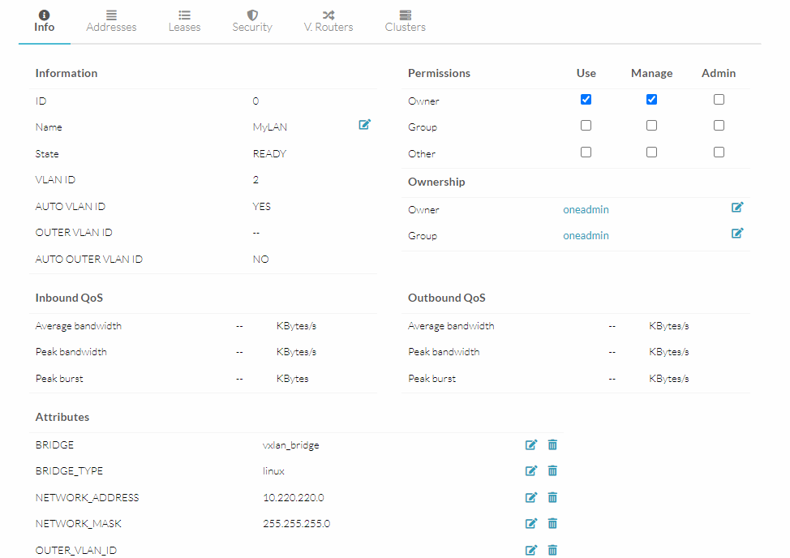

# II. 3. Setup réseau

## Sommaire

- [II. 3. Setup réseau](#ii-3-setup-réseau)
  - [Sommaire](#sommaire)
  - [B. Création du Virtual Network](#b-création-du-virtual-network)
  - [C. Préparer le bridge réseau](#c-préparer-le-bridge-réseau)

## B. Création du Virtual Network

➜ **RDV de nouveau sur la WebUI de OpenNebula, et naviguez dans `Network > Virtual Networks`**

- un nom de réseau (ce que vous voulez)
- le mode VXLAN
- Onglet `Conf`
  - spécifiez `eth1` en interface réseau physique (l'interface qui a une IP statique sur votre machine)
  - définissez `vxlan_bridge` en nom de bridge (attention aux commandes plus bas si vous choisissez un autre nom)
- Onglet `Addresses`
  - spécifiez une IP de départ dans `First IPv4 address`, par exemple `10.220.220.1/24`
  - indiquez aussi ainsi qu'un nombre de machines possibles dans ce réseau avec `Size`
- Onglet `Context`
  - spécifier une adresse de réseau et un masque dans les champs dédiés, par exemple `10.220.220.0` et `255.255.255.0`



## C. Préparer le bridge réseau


🌞 **Créer et configurer le bridge Linux**

```bash
# création du bridge
ip link add name vxlan_bridge type bridge

# on allume le bridge
ip link set dev vxlan_bridge up 

# on définit une IP sur cette interface bridge
ip addr add 10.220.220.201/24 dev vxlan_bridge

# ajout de l'interface bridge à la zone public de firewalld
firewall-cmd --add-interface=vxlan_bridge --zone=public --permanent

# activation du masquerading NAT dans cette zone
firewall-cmd --add-masquerade --permanent

# on reload le firewall pour que les deux commandes précédentes prennent effet
firewall-cmd --reload
```
